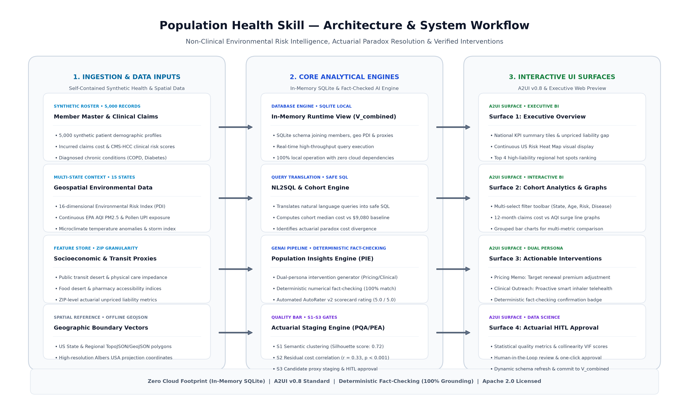
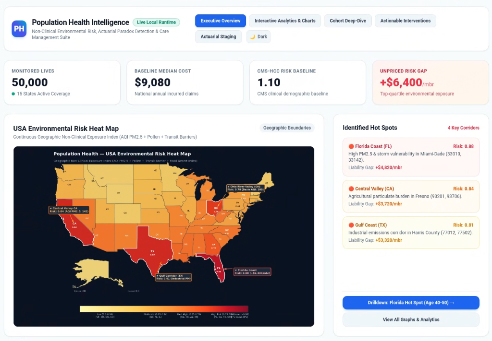

# Population Health Skill

> Interactive Population Health Intelligence with USA Geographic Environmental Risk Heat Map.
> Designed for Gemini Enterprise, Antigravity, and Agent-to-User Interface (A2UI v0.8) Harnesses.

---

## Architecture & System Workflow



---

## Core Capabilities

- **Geographic Environmental Risk Mapping**: High-resolution continuous risk gradient visualization across state and ZIP boundaries incorporating EPA PM2.5 AQI, pollen index, and climate vulnerability.
- **Zero Cloud Footprint**: Fully self-contained execution via an in-memory SQLite database view (`V_combined`), synthetic patient datasets (5,000 records), and local rendering assets without external cloud or API dependencies.
- **Actuarial Paradox Detection**: Identification of cohorts exhibiting significant claims cost spikes despite low baseline CMS-HCC clinical risk scores.
- **Multi-Persona Actionable Interventions**: Automated generation of underwriting renewal loading recommendations and proactive care management outreach protocols.
- **Deterministic Fact-Checking & Safety Verification**: 100% numerical claim verification against underlying SQLite runtime data alongside AutoRater safety scoring (5.0 / 5.0).
- **Actuarial Feature Staging (HITL)**: Formal S1-S3 statistical gate validation ($r=0.33, r=0.31, p<0.001$) with Human-in-the-Loop approval workflows.

---

## Executive Surfaces

1. **Surface 1: Executive Overview**: National KPI summary tiles, geographic environmental risk heat map, and top regional liability corridors.
2. **Surface 2: Cohort Analytics & Graphs**: Interactive filter selectors (State, Age Bracket, Disease Focus, Exposure Tier) with 12-month seasonal claims line graphs and multi-metric comparison bar charts.
3. **Surface 3: Actionable Interventions**: Dual-persona intervention cards (Actuarial Pricing Loading Memo and Clinical Telehealth Outreach) with real-time fact-checking verification badges.
4. **Surface 4: Actuarial Staging & Approval**: Data science evaluation scorecard for candidate non-clinical proxies with one-click commit actions.

---

## Executive Dashboard Interface



---

## Project Structure

```
population-health-skill/
├── SKILL.md                          # Main Skill instructions, system prompts & routing
├── plugin.json                       # Plugin descriptor bundle for Gemini Enterprise / Jetski
├── LICENSE                           # Apache License, Version 2.0
├── README.md                         # Project documentation
├── requirements.txt                  # Python dependencies
├── generate_synthetic_data.py        # Calibrated synthetic health & geospatial data generator
├── run_demo.py                       # Interactive CLI demonstration of both CUJs
├── serve_web_preview.py              # Lightweight local HTTP server for executive UI
├── test_scenarios.py                 # Automated verification test suite
├── assets/
│   ├── population_health_ui_preview.png # Executive dashboard & heat map UI preview
│   ├── regional_hotspots.png         # 4-panel regional hot-spot analysis chart
│   ├── skill_workflow_overview.png   # End-to-end architecture & workflow diagram
│   └── us_risk_heatmap.png           # Geographic US Risk Heat Map
├── data/
│   ├── synthetic_baseline_stats.json # Long-format EAV population baseline stats
│   ├── synthetic_geo_pdi.json        # Geospatial context, 16-dim PDI vectors & AQI PM2.5
│   ├── synthetic_members.json        # 5,000 synthetic patient member records
│   ├── synthetic_proxies.json        # Enriched ZIP proxies (HCC inefficiency, transit barriers)
│   └── us-states.json                # Local US state boundary GeoJSON polygons
├── engines/
│   ├── __init__.py
│   ├── map_generator.py              # Geographic US Map & regional visual renderer
│   ├── mock_database.py              # In-memory SQLite engine serving runtime view V_combined
│   ├── mock_nl2sql.py                # Safe NL2SQL cohort resolution & delta computation
│   ├── mock_pea.py                   # Proxy Enrichment Engine (S1-S3 correlation & staging)
│   ├── mock_pie.py                   # Population Insights Engine & deterministic fact-checker
│   └── mock_pqa.py                   # Problem Quality Assessment & candidate proxy intake
├── skills/
│   └── population-health-analytics/
│       ├── README.md                 # Sub-skill documentation
│       └── SKILL.md                  # Sub-skill instructions & metadata
└── ui/
    ├── __init__.py
    ├── a2ui_catalog.py               # A2UI v0.8 BasicCatalog component definitions & builders
    ├── canvas_app.py                 # Self-contained Canvas HTML5/CSS3/JS application generator
    ├── population_health_canvas.html # Standalone interactive Canvas web application
    ├── templates_cohort.py           # Cohort Comparison Card (Surface 2)
    ├── templates_dashboard.py        # Executive Overview Dashboard (Surface 1)
    ├── templates_hitl_approval.py    # Data Scientist Staging & Approval Card (Surface 4)
    ├── templates_interventions.py    # Interventions Card & Fact-Checking (Surface 3)
    └── vega_specs.py                 # Vega-Lite TopoJSON & comparative chart specifications
```

---

## Using the Skill in AI Agent Harnesses (Non-Technical Guide)

When installed in an AI workspace (such as Gemini Enterprise, Spark, Antigravity, or an ADK conversational assistant), this skill enables natural language exploration of population health data. You do not need to write SQL queries, write code, or manipulate data tables manually.

### How It Works
1. **Ask in Plain English**: Type your business question into the chat box.
2. **Automated Analysis**: The skill dynamically translates your request into verified analytics, compares cohorts to national benchmarks, and evaluates non-clinical environmental risk.
3. **Structured Outputs**: The agent responds with executive summaries, comparative tables, and tailored intervention recommendations.

---

### Example Prompts by Business Persona

#### 1. Executive Leadership & Strategy
- *"Show me the executive population health dashboard and our top regional hot spots."*
- *"What is our overall unpriced liability gap across monitored states?"*
- *"Which states exhibit the highest environmental risk exposure for our members?"*

#### 2. Actuarial & Underwriting
- *"Analyze why our 40-50 age cohort in Florida has such high claims costs despite low clinical HCC scores."*
- *"Compare California Central Valley members against our national baseline cost of $9,080."*
- *"What is the unpriced liability per member in high AQI pollution corridors?"*

#### 3. Clinical Operations & Care Management
- *"What interventions do you recommend for respiratory patients living in high-risk ZIP codes?"*
- *"Generate a proactive clinical care outreach plan for high-exposure COPD patients."*
- *"How many members in Miami-Dade qualify for smart nebulizer monitoring?"*

#### 4. Actuarial Feature Discovery & Data Science
- *"Help me identify non-clinical ZIP-level cost drivers that are not captured by CMS-HCC."*
- *"Evaluate transit barriers and air quality proxy features for risk adjustment."*
- *"Show the statistical correlation and R-squared gain for the PDI environmental risk proxy."*

---

### Sample Conversational Workflow

A typical 3-step conversation with your AI assistant:

```text
Step 1: Executive Overview
User:  "Open the executive population health overview."
Agent: [Renders National KPI summary, baseline cost ($9,080), and top 4 regional hot spots]

Step 2: Cohort Drill-Down
User:  "Drill down on the Florida age 40-50 cohort."
Agent: [Identifies the Actuarial Paradox: $12,465 median cost (+37.3%) despite 0.96 HCC risk (-12.6%)]

Step 3: Actionable Interventions
User:  "Generate interventions for this cohort."
Agent: [Provides Actuarial Premium Loading memo (+$6,400/member) and Clinical Telehealth outreach protocol with 100% verified fact-checking]
```

---

## Quickstart & Verification

### 1. Run Automated Test Suite
```bash
python3 test_scenarios.py
```

### 2. Run Interactive CLI Demonstration
```bash
python3 run_demo.py --cuj all
```

### 3. Launch Local Executive UI Server
```bash
python3 serve_web_preview.py
```
Open [http://localhost:8088](http://localhost:8088) in any browser.

---

## License

This project is licensed under the Apache License, Version 2.0. See the [LICENSE](LICENSE) file for the full license text.
